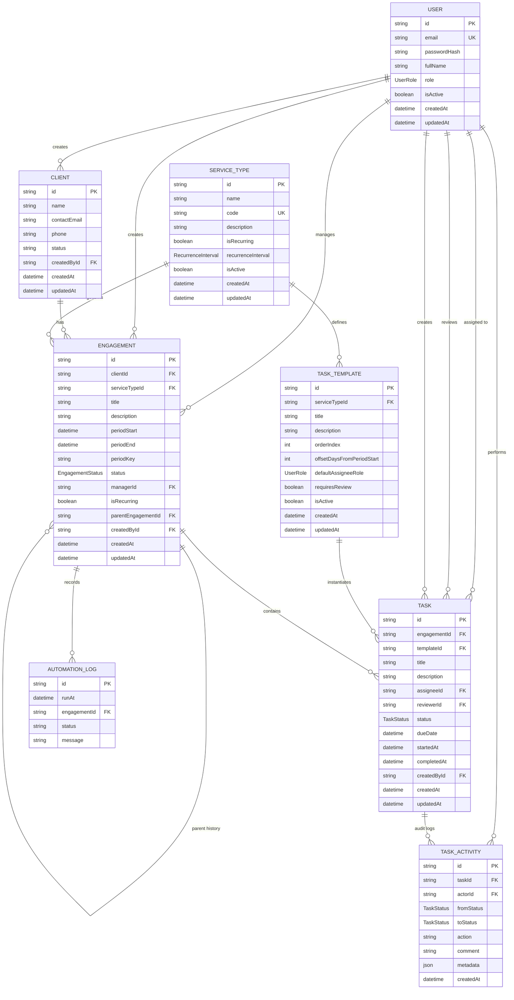

# TaskFlow — Complete Architecture, Workflow & Role Governance Guide

Welcome to the comprehensive technical and operational guide for **TaskFlow**. This document provides an exhaustive breakdown of the platform's architectural design, underlying data models, automated workflow engines, and the precise capabilities of every user role (**Admin**, **Manager**, and **Team Member**).

---

## Table of Contents

1. [Executive Summary & Business Context](#1-executive-summary--business-context)
2. [What TaskFlow Can Do (Core Capabilities)](#2-what-taskflow-can-do-core-capabilities)
3. [Full System Architecture](#3-full-system-architecture)
   - [Architectural Topology](#architectural-topology)
   - [Monorepo Codebase Organization](#monorepo-codebase-organization)
   - [Middleware Execution Pipeline](#middleware-execution-pipeline)
4. [Data Architecture & Entity Relationships](#4-data-architecture--entity-relationships)
   - [Entity Relationship Diagram (ERD)](#entity-relationship-diagram-erd)
   - [Database Entities & Data Dictionary](#database-entities--data-dictionary)
   - [Database Constraints & Concurrency Guarantees](#database-constraints--concurrency-guarantees)
5. [Detailed Full Working of the System](#5-detailed-full-working-of-the-system)
   - [End-to-End Engagement & Task Lifecycle](#end-to-end-engagement--task-lifecycle)
   - [The Task State Machine & Directed Transition Graph](#the-task-state-machine--directed-transition-graph)
   - [The Maker-Checker Rule (Anti-Self-Approval)](#the-maker-checker-rule-anti-self-approval)
   - [The Recurrence & Period Generation Engine](#the-recurrence--period-generation-engine)
   - [Immutable Audit Trail & Activity Logging](#immutable-audit-trail--activity-logging)
   - [Role-Scoped Real-Time Dashboard & KPI Engine](#role-scoped-real-time-dashboard--kpi-engine)
6. [Role-Based Access Control (RBAC): What Each User Can Do](#6-role-based-access-control-rbac-what-each-user-can-do)
   - [Master RBAC Permission Matrix](#master-rbac-permission-matrix)
   - [Administrator (Partner / System Owner)](#administrator-partner--system-owner)
   - [Manager (Engagement Lead / Supervisor)](#manager-engagement-lead--supervisor)
   - [Team Member (Associate / Staff Preparer)](#team-member-associate--staff-preparer)
7. [API Route Specifications & Protection Layers](#7-api-route-specifications--protection-layers)
8. [Architectural Decision Records (ADRs) & Scaling Strategy](#8-architectural-decision-records-adrs--scaling-strategy)

---

## 1. Executive Summary & Business Context

**TaskFlow** is a purpose-built engagement and compliance workflow management platform engineered specifically for **professional services firms** — such as Chartered Accountancy (CA) practices, corporate tax consultancies, audit firms, and legal compliance teams.

### The Real-World Problems TaskFlow Solves

Professional services firms operate under strict statutory deadlines with recurring deliverables:

| Industry Challenge | Consequences | How TaskFlow Solves It |
|---|---|---|
| **Spreadsheet Chaos** | Work tracked on disconnected Excel sheets or WhatsApp groups leads to missed filing deadlines. | Centralized dashboard with automated deadline tracking and real-time status badges. |
| **Recurring Compliance Overhead** | Manually creating monthly/quarterly engagements (e.g. GST returns, TDS filings) every month is prone to human error and duplicate records. | **Automated Recurrence Engine** clones engagements and tasks automatically on the 1st of every month without duplicates. |
| **Maker-Checker Violation** | Junior associates approving their own tax computations leads to audit penalties and client compliance errors. | **Hard Anti-Self-Approval Invariant**: Assignees are strictly blocked at the backend API layer from approving their own work. |
| **No Audit Defense** | Regulators and clients dispute when data was collected, who reviewed it, and why a deadline was missed. | **Immutable TaskActivity Log**: Every assignment, status transition, comment, and review decision is cryptographically timestamped. |

---

## 2. What TaskFlow Can Do (Core Capabilities)

```
┌──────────────────────────────────────────────────────────────────────────────────┐
│                             TASKFLOW CORE CAPABILITIES                           │
├──────────────────────┬──────────────────────┬────────────────────────────────────┤
│ 1. CLIENT & SERVICE  │ 2. ENGAGEMENT        │ 3. WORKFLOW & AUDIT                │
│    MANAGEMENT        │    ORCHESTRATION     │    GOVERNANCE                      │
├──────────────────────┼──────────────────────┼────────────────────────────────────┤
│ • Onboard corporate  │ • One-time projects  │ • 7-state legal workflow graph     │
│   clients with email │   (e.g. branch GST   │ • Dual-control review flow         │
│   and contact info   │   registrations)     │ • Maker-Checker separation         │
│ • Configure standard │ • Recurring monthly/ │ • Full chronological audit log     │
│   service blueprints │   quarterly services │ • Assignment & deadline management │
│ • Define step-by-step│ • Automated period   │ • Role-scoped real-time KPIs       │
│   task templates &   │   generation without │ • Instant search, filtering, and   │
│   due date offsets   │   duplicate records  │   pagination across all views      │
└──────────────────────┴──────────────────────┴────────────────────────────────────┘
```

1. **Client Management**: Maintain an active registry of client accounts with contact personnel, corporate emails, phone numbers, and engagement history.
2. **Standard Service Catalog & Blueprints**: Define reusable compliance services (e.g., *Monthly GST Compliance*, *Quarterly TDS Return*, *Statutory Audit*). Each service blueprint contains predefined task templates with execution order, due date offsets from period start, and review requirements.
3. **Automated Period Generation**: Automatically computes period keys (e.g., `2026-09`) and rolls forward recurring engagements every month or quarter, generating concrete tasks from templates inside an isolated, atomic transaction.
4. **Strict State Machine Workflow**: Prevents unauthorized status skips (e.g., jumping directly from `not_started` to `completed`).
5. **Anti-Self-Approval Verification**: Guarantees that the associate preparing the work cannot sign off on their own deliverable. Review and approval requires an independent reviewer or manager.
6. **Immutable Audit Trails**: Captures every state transition, assignment change, review rejection, and internal comment in a chronological activity log.
7. **Role-Scoped Dashboard**: Surfaces instant operational counts for open deliverables, overdue tasks, items waiting for client documents, and tasks awaiting manager review.

---

## 3. Full System Architecture

### Architectural Topology

TaskFlow follows a modern, decoupled **3-Tier Cloud Architecture** optimized for zero infrastructure maintenance, continuous deployment, and horizontal scalability.

```
                                 ┌─────────────────────────────────────────┐
                                 │            Internet / Users             │
                                 └────────────────────┬────────────────────┘
                                                      │
                                                      │ HTTPS / TLS
                                                      ▼
                       ┌─────────────────────────────────────────────────────────────┐
                       │                      VERCEL EDGE CDN                        │
                       │                  (Frontend SPA Hosting)                     │
                       │                                                             │
                       │  • React 18 + Vite Production Bundle                        │
                       │  • React Router v6 (with v7 future flags)                   │
                       │  • Pure Custom CSS Design System (Zero UI Dependencies)     │
                       │  • Client-side routing rewrite rules (vercel.json)          │
                       │  • Dynamic origin: https://task-flow-two-teal.vercel.app    │
                       └──────────────────────────────┬──────────────────────────────┘
                                                      │
                                                      │ REST JSON API
                                                      │ Authorization: Bearer <JWT>
                                                      ▼
                       ┌─────────────────────────────────────────────────────────────┐
                       │                    RENDER WEB SERVICE                       │
                       │                   (Backend Node.js API)                     │
                       │                                                             │
                       │  • Express 4.x REST Server (ES Modules)                     │
                       │  • Security: Helmet (Cross-Origin), CORS Dynamic Whitelist  │
                       │  • Input Validation: Zod Schemas                            │
                       │  • Recurrence Scheduler: node-cron (Daily 02:00 UTC)        │
                       │  • Error Normalization & Health Diagnostics                 │
                       │  • Public API: https://taskflow-api-udt6.onrender.com       │
                       └──────────────────────────────┬──────────────────────────────┘
                                                      │
                                                      │ Prisma Client (Pooled TCP)
                                                      │ SSL Require + PgBouncer
                                                      ▼
                       ┌─────────────────────────────────────────────────────────────┐
                       │                   NEON POSTGRESQL CLUSTER                   │
                       │                    (Serverless Database)                    │
                       │                                                             │
                       │  • Runtime Pooler: ep-xyz-pooler.neon.tech (Port 5432/6543) │
                       │  • Direct DDL Endpoint: ep-xyz.neon.tech (Migrations)       │
                       │  • Composite Unique Constraints for Concurrency Safety      │
                       │  • Foreign Keys with Cascade Cleanup Rules                  │
                       │  • Transactional Isolation for Multi-Table Writes           │
                       └─────────────────────────────────────────────────────────────┘
```

---

### Monorepo Codebase Organization

The codebase is organized as a clean full-stack monorepo separating frontend presentation, backend domain logic, and shared configurations:

```
task-engagement-tool/
├── backend/                              # Express REST API & Database Layer
│   ├── prisma/
│   │   ├── schema.prisma                 # PostgreSQL database schema & relations
│   │   ├── migrations/                   # Sequential SQL migration files
│   │   └── seed.js                       # Comprehensive database seeder (users, templates, tasks)
│   ├── src/
│   │   ├── config/
│   │   │   ├── env.js                    # Strict environment variable validation
│   │   │   └── prisma.js                 # PrismaClient singleton instance
│   │   ├── controllers/                  # Thin HTTP controllers (unpack inputs, send JSON)
│   │   │   ├── auth.controller.js
│   │   │   ├── user.controller.js
│   │   │   ├── client.controller.js
│   │   │   ├── serviceType.controller.js
│   │   │   ├── taskTemplate.controller.js
│   │   │   ├── engagement.controller.js
│   │   │   ├── task.controller.js
│   │   │   ├── dashboard.controller.js
│   │   │   └── health.controller.js
│   │   ├── cron/
│   │   │   └── recurring.js              # node-cron daily scheduler (02:00 UTC)
│   │   ├── middleware/                   # Express middleware pipeline
│   │   │   ├── auth.js                   # JWT verification & req.user attachment
│   │   │   ├── requireRole.js            # Role-Based Access Control (RBAC) guard
│   │   │   ├── validate.js               # Zod schema validation middleware
│   │   │   └── errorHandler.js           # Centralized exception handler & error codes
│   │   ├── models/                       # Data Access Layer (direct Prisma operations)
│   │   │   ├── user.model.js
│   │   │   ├── client.model.js
│   │   │   ├── serviceType.model.js
│   │   │   ├── taskTemplate.model.js
│   │   │   ├── engagement.model.js
│   │   │   ├── task.model.js
│   │   │   ├── taskActivity.model.js
│   │   │   └── automationLog.model.js
│   │   ├── routes/                       # Express router mounting
│   │   │   ├── index.js                  # Master API router (/api/*)
│   │   │   ├── auth.routes.js
│   │   │   ├── user.routes.js
│   │   │   ├── client.routes.js
│   │   │   ├── serviceType.routes.js
│   │   │   ├── engagement.routes.js
│   │   │   ├── task.routes.js
│   │   │   ├── dashboard.routes.js
│   │   └── internal.routes.js
│   ├── services/                         # Core Business Logic & State Machines
│   │   ├── auth.service.js
│   │   ├── user.service.js
│   │   ├── client.service.js
│   │   ├── serviceType.service.js
│   │   ├── taskTemplate.service.js
│   │   ├── engagement.service.js
│   │   ├── task.service.js               # State machine, Anti-Self-Approval, and review logic
│   │   ├── recurring.service.js          # Period key calculation & automated cloning
│   │   └── dashboard.service.js          # Role-scoped operational KPI counts
│   ├── utils/
│   │   ├── asyncHandler.js               # Wraps async controllers to catch unhandled errors
│   │   ├── errors.js                     # Custom AppError class with HTTP status codes
│   │   └── periodKey.js                  # Standardized period computation helpers
│   ├── validators/                       # Zod validation schemas for all requests
│   │   ├── auth.validator.js
│   │   ├── user.validator.js
│   │   ├── client.validator.js
│   │   ├── serviceType.validator.js
│   │   ├── taskTemplate.validator.js
│   │   ├── engagement.validator.js
│   │   ├── task.validator.js
│   │   └── common.validator.js
│   ├── app.js                            # Express app configuration & middleware stack
│   └── index.js                          # Server startup listener & cron initialization
│   ├── tests/                            # Vitest + Supertest integration test suite (21 tests)
│   └── package.json
│
├── frontend/                             # React 18 Single-Page Application (SPA)
│   ├── public/                           # Static assets
│   ├── src/
│   │   ├── api/                          # HTTP client & API service modules
│   │   │   ├── client.js                 # Fetch wrapper with JWT headers & error interceptor
│   │   │   ├── auth.api.js
│   │   │   ├── users.api.js
│   │   │   ├── clients.api.js
│   │   │   ├── serviceTypes.api.js
│   │   │   ├── templates.api.js
│   │   │   ├── engagements.api.js
│   │   │   ├── tasks.api.js
│   │   │   └── dashboard.api.js
│   │   ├── components/                   # Modular presentation components
│   │   │   ├── Sidebar.jsx               # Role-aware navigation sidebar
│   │   │   ├── Navbar.jsx                # User profile bar with role badge & logout
│   │   │   ├── TaskDrawer.jsx            # Sliding slide-over drawer for task details & audit logs
│   │   │   ├── TaskModal.jsx             # Modal dialog for creating ad-hoc tasks
│   │   │   ├── EngagementModal.jsx       # Modal dialog for creating new engagements
│   │   │   ├── ClientModal.jsx           # Modal dialog for onboarding clients
│   │   │   ├── StatusBadge.jsx           # Color-coded badge for task and engagement states
│   │   │   └── ProtectedRoute.jsx        # Client-side route guard enforcing authentication & roles
│   │   ├── context/
│   │   │   └── AuthContext.jsx           # Global authentication state, session storage & login/logout
│   │   ├── pages/                        # Primary application views
│   │   │   ├── Login.jsx                 # User sign-in with 1-click demo account buttons
│   │   │   ├── Dashboard.jsx             # KPI overview cards, filters, and operational summary
│   │   │   ├── MyTasks.jsx               # Personal execution workspace for Team Members
│   │   │   ├── Engagements.jsx           # Engagement listing, period generator, and task views
│   │   │   ├── Clients.jsx               # Client directory management
│   │   │   ├── AdminUsers.jsx            # Admin user administration (role changes, deactivation)
│   │   │   ├── AdminServiceTypes.jsx     # Admin catalog for service types
│   │   │   ├── AdminTemplates.jsx        # Admin task blueprint builder with step order & offsets
│   │   │   └── Unauthorized.jsx          # Friendly 403 Forbidden screen
│   │   ├── App.jsx                       # Route tree definition with React Router v7 future flags
│   │   ├── index.css                     # Pure CSS design system with CSS custom properties
│   │   └── main.jsx                      # Vite React entry point
│   ├── vercel.json                       # Vercel SPA routing rewrite rules
│   └── package.json
│
├── DESIGN.md                             # Formal system design note
├── deployment.md                         # End-to-end cloud deployment guide (Render + Vercel + Neon)
└── LEARN.md                              # This comprehensive learning guide
```

---

### Middleware Execution Pipeline

Every HTTP request sent to the backend passes through a rigorous multi-stage middleware pipeline before reaching domain business logic:

```
[Incoming HTTP Request from Vercel / Client]
                       │
                       ▼
1. Security Headers: helmet({ crossOriginResourcePolicy: { policy: 'cross-origin' } })
                       │
                       ▼
2. CORS Origin Validator: Validates against CLIENT_ORIGINS whitelist & *.vercel.app regex
                       │  Handles preflight OPTIONS requests via app.options('*', cors(...))
                       ▼
3. Response Compression: compression() compresses JSON payloads using gzip / deflate
                       │
                       ▼
4. Structured Logger: morgan('combined' / 'dev') logs method, path, status, and latency
                       │
                       ▼
5. JSON Body Parser: express.json({ limit: '100kb' }) safely parses request payloads
                       │
                       ▼
6. Authentication Guard: auth middleware decodes Authorization: Bearer <JWT>
                       │  Attaches verified user: req.user = { id, role }
                       ▼
7. RBAC Role Gatekeeper: requireRole('admin', 'manager') checks if req.user.role is permitted
                       │  Returns 403 Forbidden if user lacks necessary permissions
                       ▼
8. Input Validator: validate({ params, query, body }) evaluates data against Zod schemas
                       │  Returns 400 Bad Request with field-level issues if validation fails
                       ▼
9. Business Service: Executes domain logic inside atomic prisma.$transaction
                       │
                       ▼
10. Centralized Error Handler: errorHandler middleware catches any thrown errors:
                       │  • AppError -> Returns configured statusCode (400, 401, 403, 404)
                       │  • P2002 -> Returns 409 Conflict (Duplicate engagement or task)
                       │  • P2021 -> Returns 500 (Missing database migrations)
                       │  • P2024 / Connection Error -> Returns 503 Service Unavailable
                       │  • Unhandled Error -> Logs stack trace and returns safe 500
```

---

## 4. Data Architecture & Entity Relationships

### Entity Relationship Diagram (ERD)



---

### Database Entities & Data Dictionary

#### 1. `User`
Stores firm staff profiles, hashed credentials, and role assignments.
- `id` (UUID): Primary key.
- `email` (String, Unique): Normalized lowercase login address.
- `passwordHash` (String): Salted bcrypt password hash.
- `fullName` (String): Display name used across the UI.
- `role` (Enum: `admin`, `manager`, `team_member`): System permission level.
- `isActive` (Boolean): Soft-disable switch for departing employees.

#### 2. `Client`
Represents customer businesses for whom professional services are performed.
- `id` (UUID): Primary key.
- `name` (String): Business legal name (e.g. *Acme Traders*).
- `contactEmail` (String): Primary billing or accounts point of contact.
- `phone` (String): Contact phone number.
- `status` (String, default `active`): Operational status.
- `createdById` (UUID, Foreign Key &rarr; `User`): Staff member who onboarded the client.

#### 3. `ServiceType`
The master catalog of services offered by the firm.
- `id` (UUID): Primary key.
- `name` (String): Service title (e.g. *Monthly GST Compliance*).
- `code` (String, Unique): Alphanumeric code (e.g. `GST-MONTHLY`).
- `isRecurring` (Boolean): Flag declaring whether service repeats periodically.
- `recurrenceInterval` (Enum: `monthly`, `quarterly`, `yearly`): Frequency of generation.

#### 4. `TaskTemplate`
Standard operating procedure (SOP) blueprints attached to a `ServiceType`.
- `id` (UUID): Primary key.
- `serviceTypeId` (UUID, Foreign Key &rarr; `ServiceType`): Associated service catalog item.
- `title` (String): Standard task deliverable (e.g. *File GSTR-3B*).
- `orderIndex` (Integer): Sequential execution position.
- `offsetDaysFromPeriodStart` (Integer): Relative days added to `periodStart` to compute `dueDate`.
- `defaultAssigneeRole` (Enum: `team_member`, `manager`, `admin`): Recommended execution role.
- `requiresReview` (Boolean): Requires manager approval before marking complete.

#### 5. `Engagement`
A concrete commercial contract or filing period for a specific client.
- `id` (UUID): Primary key.
- `clientId` (UUID, Foreign Key &rarr; `Client`): Client entity.
- `serviceTypeId` (UUID, Foreign Key &rarr; `ServiceType`): Service being delivered.
- `periodKey` (String): ISO temporal key (e.g. `2026-09`).
- `periodStart` / `periodEnd` (DateTime): Calendar boundaries of the compliance window.
- `status` (Enum: `draft`, `active`, `completed`, `cancelled`): Engagement lifecycle state.
- `managerId` (UUID, Foreign Key &rarr; `User`): Designated engagement supervisor.
- `parentEngagementId` (UUID, Self-Referential FK): Links recurring chain history.

#### 6. `Task`
The actionable unit of work with assigned personnel, deadlines, and current state.
- `id` (UUID): Primary key.
- `engagementId` (UUID, Foreign Key &rarr; `Engagement`): Parent engagement container.
- `templateId` (UUID, Foreign Key &rarr; `TaskTemplate`, Nullable): Originating template if generated.
- `title` / `description` (String): Work instructions.
- `assigneeId` (UUID, Foreign Key &rarr; `User`, Nullable): Staff member responsible for execution.
- `reviewerId` (UUID, Foreign Key &rarr; `User`, Nullable): Supervisor responsible for review.
- `status` (Enum: `not_started`, `in_progress`, `waiting_for_client`, `ready_for_review`, `changes_requested`, `completed`, `cancelled`).
- `dueDate` (DateTime, Nullable): Completion deadline.
- `startedAt` / `completedAt` (DateTime, Nullable): Automatic lifecycle timestamps.

#### 7. `TaskActivity`
Append-only, immutable audit trail for compliance verification.
- `id` (UUID): Primary key.
- `taskId` (UUID, Foreign Key &rarr; `Task`): Related task.
- `actorId` (UUID, Foreign Key &rarr; `User`, Nullable): User who performed the action.
- `fromStatus` / `toStatus` (Enum): State delta.
- `action` (String): Category (`status_change`, `assigned`, `review`, `comment`, `created`).
- `comment` (String, Nullable): Operational feedback or reason for status shift.
- `createdAt` (DateTime): Timestamp of the event.

---

### Database Constraints & Concurrency Guarantees

TaskFlow leverages PostgreSQL's relational engine to guarantee data integrity at the lowest level:

1. **Engagement Idempotency Constraint**:
   ```prisma
   @@unique([clientId, serviceTypeId, periodKey])
   ```
   **Invariant**: A client *cannot* have more than one engagement for the same service in the same period. Even if multiple cron workers or users trigger generation simultaneously, PostgreSQL rejects duplicates with unique violation error `P2002`.

2. **Task Idempotency Constraint**:
   ```prisma
   @@unique([engagementId, templateId])
   ```
   **Invariant**: A task template cannot be cloned more than once into the same engagement.

3. **High-Performance Query Indexes**:
   - `@@index([assigneeId, status, dueDate])`: Enables sub-5ms lookups on the **My Tasks** view.
   - `@@index([reviewerId, status])`: Optimizes supervisor queues for pending reviews.
   - `@@index([taskId, createdAt(sort: Desc)])`: Guarantees instant chronological audit log rendering in the task drawer.

---

## 5. Detailed Full Working of the System

### End-to-End Engagement & Task Lifecycle

The following sequence illustrates how work originates, progresses, and reaches completion across the system:

```
[1. Service Blueprint Configuration (Admin)]
    Admin creates "Monthly GST Compliance" (GST-MONTHLY) with 2 templates:
    - Step 1: "Collect client invoices" (Due: Period Start + 5 days)
    - Step 2: "Reconcile ITC & File GSTR-3B" (Due: Period Start + 20 days, Requires Review)
                     │
                     ▼
[2. Engagement Creation (Admin or Manager)]
    An engagement is created for client "Acme Traders" for period "2026-09".
    The system materializes concrete Task records from the templates inside a transaction.
                     │
                     ▼
[3. Work Delegation & Assignment (Manager)]
    Manager assigns Step 1 to Associate "Alice" and sets Sarah as Reviewer.
    An 'assigned' event is written to TaskActivity.
                     │
                     ▼
[4. Work Execution (Team Member: Alice)]
    Alice opens "My Tasks", clicks "Start Work". Status becomes 'in_progress'.
    StartedAt timestamp is recorded automatically.
                     │
                     ▼
[5. Roadblock / Client Dependency (Alice)]
    Client has missing invoices. Alice moves status to 'waiting_for_client'
    with comment "Awaiting July purchase ledger from client".
    Client sends documents; Alice moves status back to 'in_progress'.
                     │
                     ▼
[6. Submit Deliverable for Review (Alice)]
    Work is finished. Alice clicks "Submit for Review". Status becomes 'ready_for_review'.
                     │
                     ▼
[7. Maker-Checker Review Gate (Sarah Manager)]
    Case A: Sarah spots discrepancies -> clicks "Request Changes" with notes.
            Status moves to 'changes_requested'. Alice is alerted, fixes work, and resubmits.
    Case B: Work is verified -> Sarah clicks "Approve".
            Status becomes 'completed'. completedAt timestamp is saved.
```

---

### The Task State Machine & Directed Transition Graph

Tasks cannot jump arbitrarily between states. TaskFlow enforces a strict **finite state machine** in [`backend/src/services/task.service.js`](file:///c:/ANSH/Coding/WEB/Startup%20Movers/TaskFlow/backend/src/services/task.service.js):

```
                       ┌─────────────────────────┐
                       │       not_started       │
                       └────────────┬────────────┘
                                    │
                                    │ (Start Work)
                                    ▼
       ┌───────────────────▶┌─────────────────────────┐◀───────────────────┐
       │                    │       in_progress       │                    │
       │                    └───────┬─────────┬───────┘                    │
       │                            │         │                            │
       │       (Pending client data)│         │(Submit for review)         │
       │                            ▼         ▼                            │
       │  ┌───────────────────────────┐     ┌───────────────────────────┐  │
(Resume)  │    waiting_for_client     │     │     ready_for_review      │  │
       │  └───────────────────────────┘     └──────────────┬────────────┘  │
       │                                                   │               │
       │                                 (Changes requested)               │
       │                                                   ▼               │
       │                                    ┌─────────────────────────┐    │
       └────────────────────────────────────┤    changes_requested    ├────┘
                                            └─────────────────────────┘
                                                           │
                                                           │ (Reviewer Approval)
                                                           ▼
                                            ┌─────────────────────────┐
                                            │        completed        │ (Terminal)
                                            └─────────────────────────┘
```

#### Legal Transition Matrix

| Current State | Permitted Next States | Authorized Roles | Invariants Enforced |
|---|---|---|---|
| `not_started` | `in_progress`, `cancelled` | Assignee, Manager, Admin | `startedAt` timestamp recorded on start. |
| `in_progress` | `waiting_for_client`, `ready_for_review`, `cancelled` | Assignee, Manager, Admin | Comment required if waiting on client. |
| `waiting_for_client` | `in_progress`, `cancelled` | Assignee, Manager, Admin | Allows work resumption once data received. |
| `ready_for_review` | `changes_requested`, `completed` | Reviewer, Manager, Admin | **Anti-Self-Approval**: `caller.id !== task.assigneeId`. |
| `changes_requested` | `in_progress`, `cancelled` | Assignee, Manager, Admin | Assignee resumes work to address review notes. |
| `completed` | *None* | *None (Terminal)* | `completedAt` timestamp finalized. |
| `cancelled` | *None* | Manager, Admin | Terminal state for discarded deliverables. |

---

### The Maker-Checker Rule (Anti-Self-Approval)

A core compliance requirement in professional accounting and legal firms is **dual control**: the individual who prepares a return or tax calculation cannot be the sole person who signs off on its completion.

In TaskFlow, this is enforced programmatically in [`backend/src/services/task.service.js`](file:///c:/ANSH/Coding/WEB/Startup%20Movers/TaskFlow/backend/src/services/task.service.js):

```javascript
// CRITICAL INVARIANT: Assignee cannot approve their own work!
if (user.id === task.assigneeId) {
  throw new AppError('Cannot approve own work', 403);
}
```

- If a Manager assigns a task to themselves and submits it for review, **they cannot approve it**.
- The task must be approved by **another Manager** or an **Administrator**.
- On the frontend UI, if the logged-in user is the assignee of a task in `ready_for_review`, the **Approve** button is disabled, and an informative warning banner is displayed:
  > ⚠️ *Anti-Self-Approval: You are the assignee of this task and cannot approve your own work. A different reviewer or manager must sign off.*

---

### The Recurrence & Period Generation Engine

Recurring compliance engagements (e.g. monthly GST returns) repeat on calendar intervals. TaskFlow's recurrence engine ensures zero-touch roll forward:

```
[Trigger: Cron at 02:00 UTC OR User clicks "↻ Generate Next Period"]
                              │
                              ▼
1. Scan Service Catalog: Find active services with isRecurring = true
                              │
                              ▼
2. Group Engagements by Client: Retrieve the latest engagement for each client
                              │
                              ▼
3. Calculate Next Period Key: computeNextPeriod('2026-08', 'monthly') -> '2026-09'
                              │
                              ▼
4. Idempotency Verification: Query DB for (clientId, serviceId, '2026-09')
   - If found: Skip safely (increment summary.skipped)
   - If missing: Proceed to atomic creation
                              │
                              ▼
5. Atomic Transaction (prisma.$transaction):
   - Insert new Engagement for period '2026-09'
   - Fetch active TaskTemplates for the ServiceType
   - Bulk-insert Task records with due dates offset from period start
   - Write entry into AutomationLog
```

#### Period Key Normalization Standard
- **Monthly**: `YYYY-MM` (e.g. `2026-09`, `2026-10`)
- **Quarterly**: `YYYY-Q#` (e.g. `2026-Q3`, `2026-Q4`)
- **Yearly**: `YYYY` (e.g. `2026`, `2027`)

All date calculations use UTC (`getUTCFullYear()`, `getUTCMonth()`) to eliminate timezone drift on cloud servers.

---

### Immutable Audit Trail & Activity Logging

Every action taken on a task generates an immutable record in the `TaskActivity` table within the **same atomic database transaction** as the update itself:

```javascript
await prisma.$transaction(async (tx) => {
  const updatedTask = await taskModel.update(taskId, payload, tx);

  await taskActivityModel.create({
    taskId,
    actorId: user.id,
    fromStatus: task.status,
    toStatus: newStatus,
    action: 'status_change',
    comment: comment || null
  }, tx);

  return updatedTask;
});
```

If the database or server crashes halfway through, both the task modification and the activity log roll back simultaneously.

---

### Role-Scoped Real-Time Dashboard & KPI Engine

The Dashboard calculates operational metrics on demand. Queries are automatically filtered based on the caller's role in [`backend/src/services/dashboard.service.js`](file:///c:/ANSH/Coding/WEB/Startup%20Movers/TaskFlow/backend/src/services/dashboard.service.js):

- **Administrator**: Receives firm-wide aggregated metrics across all clients and staff.
- **Manager**: Automatically scoped to engagements where `managerId === user.id` or `createdById === user.id`.
- **Team Member**: Automatically scoped to tasks where `assigneeId === user.id`.

#### Computed Metrics
1. **Open Tasks**: Active deliverables not yet completed or cancelled.
2. **Overdue Tasks**: Deliverables where `dueDate < Today (UTC)` and status is not completed/cancelled.
3. **Due Today**: Deliverables where `dueDate` falls within the current calendar day.
4. **Waiting on Client**: Deliverables blocked waiting for external client data.
5. **Waiting on Review**: Deliverables in `ready_for_review` requiring supervisor review.

---

## 6. Role-Based Access Control (RBAC): What Each User Can Do

TaskFlow implements a strict 3-tier Role-Based Access Control hierarchy:

```
               ┌─────────────────────────────────────────┐
               │              ADMINISTRATOR              │
               │   (Full System Control & Governance)    │
               └────────────────────┬────────────────────┘
                                    │
                                    ▼
               ┌─────────────────────────────────────────┐
               │                 MANAGER                 │
               │  (Engagement Ownership & QA Review)    │
               └────────────────────┬────────────────────┘
                                    │
                                    ▼
               ┌─────────────────────────────────────────┐
               │               TEAM MEMBER               │
               │     (Task Execution & Preparation)      │
               └─────────────────────────────────────────┘
```

---

### Master RBAC Permission Matrix

| Capability / Action | Administrator (`admin`) | Manager (`manager`) | Team Member (`team_member`) |
|---|:---:|:---:|:---:|
| **User Management** | | | |
| View Team User Directory | Full Access | Full Access | Full Access |
| Create New User Accounts | Full Access | Denied (403) | Denied (403) |
| Change User Roles (Admin / Manager / Member) | Full Access | Denied (403) | Denied (403) |
| Activate / Deactivate Staff Accounts | Full Access | Denied (403) | Denied (403) |
| **Service Catalog & Blueprints** | | | |
| View Service Catalog & Templates | Full Access | Full Access | Full Access |
| Create / Edit Service Types | Full Access | Denied (403) | Denied (403) |
| Create / Edit Task Templates | Full Access | Denied (403) | Denied (403) |
| **Client Management** | | | |
| View Client Directory | Full Access | Full Access | Full Access |
| Create New Clients | Full Access | Full Access | Denied (403) |
| Edit Client Information | Full Access | Full Access | Denied (403) |
| **Engagement Management** | | | |
| View Engagements | All Engagements | Managed Engagements | Assigned Tasks Only |
| Create New Engagements | Full Access | Full Access | Denied (403) |
| Trigger Recurring Period Roll Forward | Full Access | Full Access | Denied (403) |
| **Task Operations & Governance** | | | |
| View Firm-Wide Task List | Full Access | Managed Engagements | Denied (403) |
| View Personal "My Tasks" Queue | Full Access | Full Access | Assigned Tasks Only |
| Assign / Reassign Task Personnel | Full Access | Full Access (Managed) | Denied (403) |
| Set / Modify Task Due Dates | Full Access | Full Access (Managed) | Denied (403) |
| Start Task (`not_started` &rarr; `in_progress`) | Full Access | Full Access | Own Tasks Only |
| Mark Waiting (`in_progress` &rarr; `waiting_for_client`) | Full Access | Full Access | Own Tasks Only |
| Submit for Review (`in_progress` &rarr; `ready_for_review`) | Full Access | Full Access | Own Tasks Only |
| Request Changes on Review | Full Access | Full Access | Denied (400/403) |
| Approve Task (`ready_for_review` &rarr; `completed`) | If not assignee | If not assignee | Denied (400/403) |
| View Task Activity Audit Trail | Full Access | Managed Tasks | Own Tasks Only |
| Add Internal Comments to Task | Full Access | Managed Tasks | Own Tasks Only |
| **Dashboard Metrics** | | | |
| KPI Counts & Metric Scope | Firm-Wide Total | Managed Scope | Personal Scope |

---

### Administrator (Partner / System Owner)

The Administrator role represents senior firm leadership, managing partners, and IT operations heads.

#### What Admins Can Do:
1. **User Administration**:
   - Navigate to `/admin/users`.
   - Onboard new staff members and assign their initial role (`admin`, `manager`, or `team_member`).
   - Promote or demote existing users (e.g. promoting an associate to Manager).
   - Soft-deactivate user accounts when staff members leave the firm, preventing further logins while preserving historical audit logs.
2. **Service Catalog & Task Blueprint Builder**:
   - Navigate to `/admin/services` and `/admin/templates`.
   - Create new commercial service offerings (e.g. *Transfer Pricing Documentation*).
   - Configure recurrence rules (`monthly`, `quarterly`, `yearly`).
   - Build step-by-step task blueprints: define task titles, detailed instructions, order indices, relative deadline offsets from period start (e.g., +15 days), and review requirements.
3. **Firm-Wide Operational Oversight**:
   - Access the main Dashboard showing firm-wide total deliverables across all clients.
   - Inspect all engagements and tasks across all teams and departments.
   - Intervene in any task: reassign assignees, change reviewers, and update deadlines.
   - Act as final reviewer to approve tasks submitted by Managers (subject to anti-self-approval).
   - Trigger manual on-demand recurring period generation.

---

### Manager (Engagement Lead / Supervisor)

The Manager role represents engagement leads, senior associates, and department supervisors who oversee client service delivery.

#### What Managers Can Do:
1. **Client & Engagement Management**:
   - Onboard new corporate clients via the Clients page.
   - Create one-time or recurring engagements for clients, assigning themselves or other team members.
   - Trigger the **`↻ Generate Next Period`** recurrence roll forward for their client engagements.
2. **Task Delegation & Deadline Scheduling**:
   - Delegate tasks: Assign specific team members as `assignee` and designate `reviewer` personnel.
   - Set and adjust task due dates (`dueDate`) based on filing timelines.
3. **Quality Assurance & Review Gatekeeper**:
   - Monitor the **Waiting on Review** queue for deliverables submitted by team members.
   - Review submitted work:
     - **Request Changes**: Rejects deliverable back to `changes_requested` with detailed feedback comments.
     - **Approve**: Signs off on deliverable, advancing status to `completed`.
4. **Anti-Self-Approval Enforcement**:
   - If a Manager is assigned to execute a task themselves, they **cannot** approve it. They must submit it for another Manager or Admin to sign off.
5. **Scoped Analytics**:
   - The Dashboard automatically tailors counts (open, overdue, waiting on review) specifically to engagements managed by the user.

#### What Managers CANNOT Do:
- Cannot access `/admin/users` to create, modify, or deactivate user accounts.
- Cannot access `/admin/services` or `/admin/templates` to modify firm-wide service blueprints.

---

### Team Member (Associate / Staff Preparer)

The Team Member role represents frontline staff, associates, trainees, and compliance executives who execute deliverables.

#### What Team Members Can Do:
1. **Personal Task Workspace ("My Tasks")**:
   - Dedicated focused workspace at `/my-tasks` listing all deliverables assigned directly to them.
   - Sorted and filtered by priority, status, and approaching deadlines.
2. **State Transition Execution**:
   - **Start Work**: Move `not_started` &rarr; `in_progress` (automatically records start timestamp).
   - **Report Blockers**: Move `in_progress` &rarr; `waiting_for_client` with operational comments explaining what documentation is missing.
   - **Resume Work**: Move `waiting_for_client` &rarr; `in_progress` once documents arrive.
   - **Submit Deliverables**: Move `in_progress` &rarr; `ready_for_review` once preparation is complete.
3. **Respond to Revisions**:
   - When a reviewer requests changes, task appears as `changes_requested` with the reviewer's feedback.
   - Associate resumes work (`in_progress`), implements revisions, and re-submits for review.
4. **Audit Collaboration**:
   - Inspect the activity history of assigned tasks and add internal notes.

#### What Team Members CANNOT Do:
- **Cross-User Isolation**: Cannot view or modify tasks assigned to other team members. Access attempts return `403 Forbidden`.
- **Cannot Self-Complete**: Cannot mark tasks as `completed` directly. All deliverables marked `requiresReview` must pass manager review.
- **Cannot Reassign or Alter Deadlines**: Cannot change task assignees, reviewers, or due dates.
- **Cannot Access Admin or Client Creation**: Restrained from onboarding clients or altering system settings.

---

## 7. API Route Specifications & Protection Layers

The backend exposes a fully RESTful JSON API. All routes (except `/api/auth/login`, `/api/auth/register`, and root `/health`) require `Authorization: Bearer <JWT>`.

| HTTP Method | Route Endpoint | Middleware Guards | Permitted Roles | Purpose |
|---|---|---|---|---|
| `POST` | `/api/auth/login` | None (Public) | Anyone | Authenticate with email & password; returns JWT token & user profile. |
| `POST` | `/api/auth/register` | None (Public) | Anyone | Public self-registration (restricted to `team_member` role only). |
| `GET` | `/api/auth/me` | `auth` | All Roles | Validate session and fetch current user profile. |
| `GET` | `/api/users` | `auth` | All Roles | List team directory (filtered and paginated). |
| `POST` | `/api/users` | `auth`, `requireRole('admin')` | Admin | Create user account with explicit role assignment. |
| `PATCH` | `/api/users/:id/role` | `auth`, `requireRole('admin')` | Admin | Update user role (`admin`, `manager`, `team_member`). |
| `PATCH` | `/api/users/:id/active` | `auth`, `requireRole('admin')` | Admin | Activate or deactivate user login access. |
| `GET` | `/api/clients` | `auth` | All Roles | List corporate clients directory. |
| `POST` | `/api/clients` | `auth`, `requireRole('admin', 'manager')` | Admin, Manager | Onboard new corporate client. |
| `PATCH` | `/api/clients/:id` | `auth`, `requireRole('admin', 'manager')` | Admin, Manager | Update client company details or contact info. |
| `GET` | `/api/service-types` | `auth` | All Roles | View catalog of service types and recurrence intervals. |
| `POST` | `/api/service-types` | `auth`, `requireRole('admin')` | Admin | Create new service catalog item. |
| `PATCH` | `/api/service-types/:id` | `auth`, `requireRole('admin')` | Admin | Update service name, description, or recurrence. |
| `GET` | `/api/service-types/:id/templates` | `auth` | All Roles | List task templates for a specific service. |
| `POST` | `/api/service-types/:id/templates` | `auth`, `requireRole('admin')` | Admin | Add task blueprint step to a service type. |
| `GET` | `/api/engagements` | `auth` | All Roles | List engagements (automatically scoped by role). |
| `POST` | `/api/engagements` | `auth`, `requireRole('admin', 'manager')` | Admin, Manager | Create new engagement and clone tasks from templates. |
| `POST` | `/api/engagements/generate-recurring`| `auth`, `requireRole('admin', 'manager')` | Admin, Manager | Trigger on-demand recurring period generation. |
| `GET` | `/api/tasks` | `auth` | All Roles | List tasks (firm-wide for Admin, managed for Manager, assigned for Member). |
| `GET` | `/api/tasks/my` | `auth` | All Roles | Fetch tasks assigned directly to the authenticated user. |
| `GET` | `/api/tasks/:id` | `auth` | Authorized Users | Get task details, relations, and activity logs. |
| `PATCH` | `/api/tasks/:id/assign` | `auth` | Admin, Manager | Reassign assignee/reviewer or update `dueDate`. |
| `PATCH` | `/api/tasks/:id/status` | `auth` | Authorized Users | Advance task status across legal state machine transitions. |
| `POST` | `/api/tasks/:id/review` | `auth` | Reviewer, Manager, Admin | Approve (`completed`) or request changes (`changes_requested`). |
| `GET` | `/api/tasks/:id/activity` | `auth` | Authorized Users | Retrieve immutable chronological audit history. |
| `GET` | `/api/dashboard` | `auth` | All Roles | Retrieve real-time operational KPI counts scoped to user role. |
| `GET` | `/api/health` | None (Public) | Anyone | Deep diagnostic probe: returns server status and database connectivity. |
| `GET` | `/health` | None (Public) | Anyone | Fast health check endpoint for cloud container monitors (HTTP 200 OK). |

---

## 8. Architectural Decision Records (ADRs) & Scaling Strategy

### ADR 1: Why Neon PostgreSQL with Connection Pooling?
- **Decision**: Use Neon Serverless PostgreSQL with dual connection URLs (`DATABASE_URL` with PgBouncer connection pooling for runtime queries, and `DIRECT_URL` for DDL migrations).
- **Rationale**: Web apps deployed to serverless or container platforms create and destroy connections frequently. PgBouncer pooling prevents PostgreSQL connection starvation under high concurrency.

### ADR 2: Why Database Composite Unique Constraints for Idempotency?
- **Decision**: Enforce `@@unique([clientId, serviceTypeId, periodKey])` directly in the relational schema rather than relying solely on application-level checks.
- **Rationale**: If two scheduled cron jobs or user requests trigger recurring period generation concurrently, an application-level `findFirst` check has a race condition. PostgreSQL's unique constraint provides an absolute physical guarantee against duplicate engagements.

### ADR 3: Why Stateless JWT Authentication?
- **Decision**: Use signed JSON Web Tokens (JWT) stored client-side rather than server-side session cookies.
- **Rationale**: Eliminates the need for a shared session store (like Redis), enabling the backend Express API to scale horizontally across multiple instances or regions with zero session synchronization overhead.

### ADR 4: Why Pure Custom CSS Without Frameworks?
- **Decision**: Use vanilla CSS with design tokens (`--color-primary`, `--space-md`, `--radius-lg`) rather than heavy frameworks (Bootstrap, Tailwind, or Material UI).
- **Rationale**: Produces an ultra-lightweight frontend bundle (`~230 kB` uncompressed, `<70 kB` gzipped), achieves lightning-fast sub-second Vite builds, and gives complete control over accessibility and styling without framework obsolescence risk.

---

### Scaling Strategy for High-Volume Production (5M+ Tasks)

Should the platform scale to enterprise volumes (e.g. 5,000,000+ tasks):

1. **Table Partitioning**: Range-partition the `Task` and `TaskActivity` tables by year or quarter (`PARTITION BY RANGE (createdAt)`), keeping active working sets in memory.
2. **Distributed Queue for Cron**: Replace in-process `node-cron` with a distributed worker queue (e.g. BullMQ on Redis) to partition recurring generation jobs across worker pools.
3. **Read Replicas**: Route dashboard KPI count queries and reporting exports to read-only database replicas, reserving the primary cluster for transactional workflow updates.
